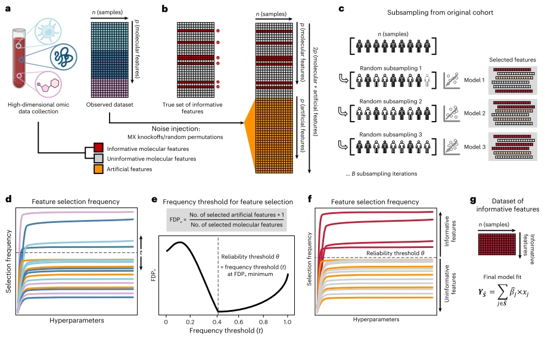
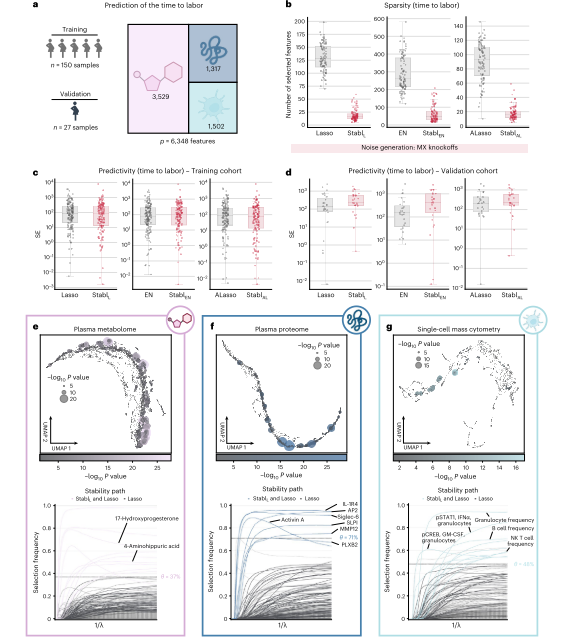

### 简介
***
本研究是斯坦福大学团队于2024发表在NBT。该研究开发了一款叫[Stabl](https://github.com/gregbellan/Stabl)的工具，Stabl适用于小样本、多组学、高维度数据集中的临床生物标记物发现。

### 背景
***
近年来，由于多组学的兴起，在具有小样本的临床研究中会产生大量的临床变量(**P>>n**)。在面临这种问题的时候，我们要保证使用的统计方法具有可预测型(**predictivity**)、稀疏性（**sparsity**,这里和我们通常理解的稀疏性不同，是指少量有代表性的生物标记）和可靠性（**reliability**）。

针对高维数据特征筛选的问题，我们通常使用的基于正则化一类的方法（lasso，elastic net）和基于这类方法的加强的版本（adaptive lasso, sparsegroup lasso）。针对于多组学的问题，近年来使用数据融合（data fusion，不是特别清楚这类方法，[有空学习一下](https://www.pnas.org/doi/10.1073/pnas.2202113119)）是一种选择。但是对于小样本的临床研究来说，往往小的扰动就会使这些方法筛选出不同的特征组合。

另外一些考虑了稳定性的方法，往往通常是通过设置先验的筛选阈值和降低假阳性率来达到的。这类方法使建模与特征选择分成两个不同的模块，可能不是很好的选择。

**Stabl**方法是基于一个有监督的机器学习框架，通过在训练阶段将原始数据加入噪音，确定信噪音比的阈值，然后再决定是否把变量纳入到预测模型中。（**原文**：Stabl combines noise injection into the original data, determination of a data-driven signal-to-noise threshold and integration of the selected features into a predictive model）

### 主要结果
***
**1. 基于错误发现率估计的（FDP, False discovery proportion）的变量选择**

传统的基于正则化的方法会将很多非信息变量筛选出来，为了解决这个问题，Stabl应用的策略是基于在多次随机采样的子集中观测变量筛选出来的频率。同时为了解决具体的频率阈值问题，引入了噪声（一种是Mx knockoffs, 另一种是random permutations）变量，从而去估计错误发现率。

图1.Stabl算法概述

>  MX knockoffs: 是一种统计学中的噪声注入技术，用于在高维数据分析中控制错误发现率（False Discovery Rate, FDR）并提高模型的稳定性和可靠性。在论文<Panning for gold:‘model-X’ knockoffs for high dimensional controlled variable selection> 有详细的介绍。MX knockoffs 的核心思想是在原始数据集中人为地引入一些与原始特征相关但不受模型关注的噪声特征（称为“knockoffs”），以此来估计和控制FDR。这些knockoffs是通过特定的数学变换从原始特征中派生出来的，它们保留了原始数据的一些结构信息，但不会与任何真实的信号特征重叠。

**2. 基于模拟数据和真实数据的评估**

为了和其他的方法对比，设计了三种参数：Sparsity, Reliability 和Predictability。基于模拟数据,和Lasso, 网格搜索方法做了对比，Stabl(基于Lasso)可以检测到更少的变量，更低的假阳性和相似的预测能力。针对多组学的数据,Stabl的策略和传统的前期数据融合不同，是在每个组学的数据集中执行Stabl然后再合并。 进一步，文章评估了多种SRM (Sparsity-promoting regularization methods)方法基于Stabl的策略比较，Stabl的策略都展示了一定的优势。 

**3. 基于真实数据的评估**

本研究共应用了5个真实数据去做测试。大概描述下其中一个基于多组学对临产时间的预测。该数据集基于一个独立训练和验证的怀孕队列纵向数据的采集。同时采集了血浆代谢组、蛋白组和单细胞数据。 图b展示了无论用那种SRM方法都可以基于Stabl的策略将筛选的变量数目降低，同时在训练和验证队列中有相似的预测能力。图e/f/g展示了筛选的feature在整体中的重要性（图的可视化呈现可以学习）。如果能搭配上对预测的正相关和负相关可能会更好。

图1.Stabl-基于多组学数据对怀孕妈妈生产日期预测

>  
Lasso encounters challenges with correlated data structures often favoring one of two correlated covariates. Elastic Net mitigates this by introducing ℓ2 regularization, encouraging consideration of multiple correlated features. 

### 结论
***
Stabl 是一种机器学习框架，旨在促进多组学生物标记物研究的临床转化。通过人工噪声注入和最小化 FDP，Stabl能够在多变量预测建模架构内以数据驱动的方式选择更少且可靠的候选生物标记物。

#### 参考

1. Hédou J, Marić I, Bellan G, et al. Discovery of sparse, reliable omic biomarkers with Stabl. Nat Biotechnol. Published online January 2, 2024.

