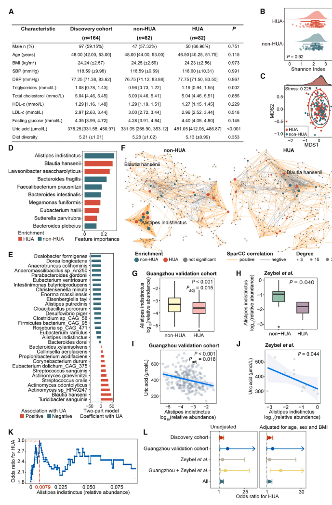
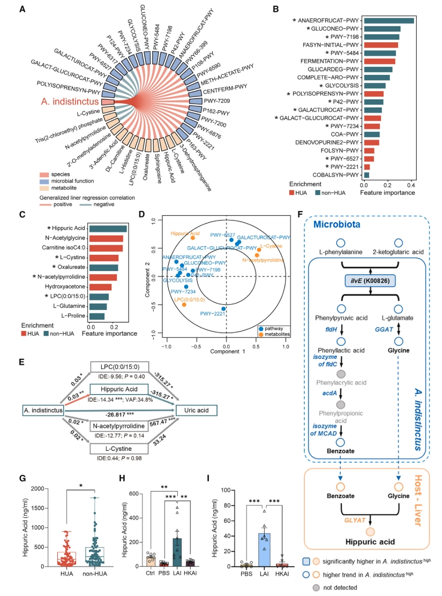

## 背景


高尿酸症常伴随着痛风，同时也是心血管疾病的风险因子。尿酸的水平和饮食的关系密切，
这也可能是近年来尿酸作为研究肠道微生物的一个突破点和可能在应用上有所发展的原因。
去年Cell期刊上有多篇研究报道了肠道微生物调控人尿酸代谢的机制[ [文献1](https://doi.org/10.1016/j.cell.2023.06.010)、[文献2](https://www.chinagut.cn/papers/read/1083032773) ]。但是本研究更突出的
一点是确定了*Alistipes indistinctus*通过马尿酸和人互作的具体靶点。中山大学这项研究非常聚焦。


``
尿酸在人体内是不能被继续降解的，大约在1500万年前，人类的尿酸氧化酶基因和启动子序列发生遗传突变，导致人体内没有尿酸氧化酶或无活性，不能将尿酸降解为尿囊素，使人类比其他哺乳动物（大猩猩除外）的尿酸水平更高。所以只能通过排泄机制把尿酸从肠道和肾脏排出去。
``


## 结果

本研究结果主要有两部分涉及到分析，都是我比较感兴趣的，详细写一下。体内和体外实验部分因为不懂，只做简要描述。

1. 高丰度的*A.indistinctus*与低风险的高尿酸症有关
    
    本研究第一个点要找到与尿酸相关的目标微生物。其实在任何一个大型队列，可以找到很多与尿酸相关的物种，甚至这种相关性在队列之间也是可以互相验证的。但是要找到效应较强且比较稳定的还是有一定难度。为了找到*A.i*，这个研究整合了多种方法和验证队列。首先发现队列是一个来自中国的匹配了多种表型case-control的横截面队列，包括了高尿酸症（男>420;女>360）和非高尿酸症。整体多样性case vs. control没有统计学差异，代表高尿酸和整体菌群的结构相关性弱。然后用随机森林和shap值找到对两分组区分能力贡献最大的物种。然后又二阶段的模型确认了下找到的feature。另外用sparCC网络在两个分组分别构建了网络，比较了两个网络的异同，主要强调了*A.i*的module在case组里消失。 然后针对*A.i*,在两个外部队列里验证了*A.i*的相关性。另外又基于*A.i*的二分类分组，来确定其与高尿酸症的关系。具体cutoff通过滑窗在发现队列里来确定最高的odd ratio的具体丰度。  
    
    
    <center>图1.A.indistinctus与高尿酸症的关系</center>
    
    接下来两个无菌小鼠喂养实验证明*A.i*的活菌可以降低血尿酸，而且主要是通过增加肠道而非肾脏的排泄实现的。第一个是基于高尿酸饮食，第二个基于正常饮食。基于先验知识，ABCG2是肠道转运尿酸的主要载体蛋白。转录组和蛋白分析都观察到了*A.i*干预后，小鼠肠道ABCG2的高表达。
  

2. 马尿酸是*A.indistinctus*菌降尿酸关键的调控代谢物。

    在重点侃侃本项研究中发现马尿酸的过程。 首先是整合了宏基因组功能和代谢组分析的结果，确定与*A.i*相关的功能和代谢物，尤其是正相关的功能通路和代谢物。然后基于case/control的随机森林模型和shap值，确定在两组中有差异的功能通路和代谢物。通过前面两种分析的交集，宏基因的功能结果主要落在短链脂肪酸产生上。代谢组的分析主要落在几种代谢物上如马尿酸、LPC、N-acetylpyrrolidine和 L-cystine。然后通过中介分析，确认这几种代谢物中具体是哪一种是由*A.i*介导来促进尿酸排泄的。马尿酸在中介分析具有最强的统计power。接下来的问题就是确认SCFA代谢具体是如何马尿酸联系起来发挥作用的(fig2F)。另外本研究还通过小鼠体内和体外实验验证，马尿酸的生成是宿主依赖的。 
    
    
    <center>图2.A.indistinctus与马尿酸的关系</center>    
    
    接下来的SPF小鼠实验首先证明了马尿酸可以促进肠道尿酸排泄和ABCG2的高表达。然后通过敲除等实验证明 PPARγ是马尿酸激活ABCG2的主要靶点。最后确定了马尿酸是如何通过PDZK1来使ABCG2在肠道毛刷状边缘膜定位。

## 总结


  该研究通过整合高尿酸症患者和匹配对照组的宏基因组学和代谢组学，发现*A.i*的减少与高尿酸血风险的增加有关，而马尿酸是*A.i*降低UA的关键。马尿酸通过增强 ABCG2 介导的肠道尿酸排泄，补充*Ai*和可缓解高尿酸血症。从机理上讲，升高马尿酸一方面通过激活 PPARg 上调 ABCG2 的转录，另一方面通过与 PDZK1 结合促进其向刷状缘膜的定位。
    

## 思考

  该细菌在人体中对尿酸的改变的作用到底有多大或者其在人尿酸干预是否具有应用潜力，还需要进一步的研究。毕竟近几年鉴定到与UA相关的细菌已经不下1百种。
  细菌和宿主搭档在宿主健康中发挥作用的思路是可以扩展的。同理，宿主同工或者宿主与细菌拮抗等都可能是具体的方向。 
    

---

```

花又开了，叶又落了，人在哪儿呢？
鱼儿轻轻一摆尾
就这样走吧

```


