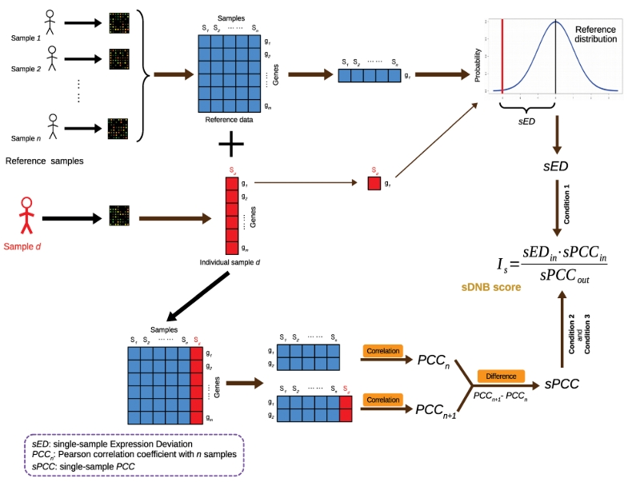
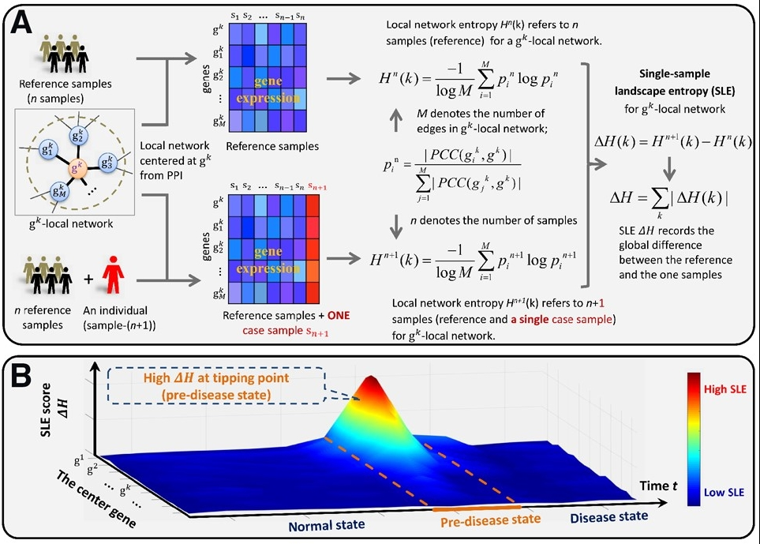

最近在看DNB相关的文章，总结下相关的内容:

最早的DNB理论是陈洛南老师在2012年提出[^1], 相关的代码可以参考[这个github仓库](https://github.com/gpli/DNB/tree/master)(**R代码结构清晰**)。DNB理论来源于物理学中的减速理论（Slowing-Down Theory）。在统计力学中，减速理论描述了粒子在封闭系统中的运动如何逐渐减慢，直到达到最大熵状态，即系统的能量分布达到最均匀的状态。在这个状态下，系统被认为是处于热平衡的，因为不再发生能量的净交换。这个理论的一个关键点是，系统达到平衡的过程是通过粒子之间的相互作用和碰撞来实现的，这些相互作用导致能量在系统中的重新分布。而映射到医学领域，疾病的发生通常也是一种稳定的状态非线性转变到另一种稳定状态，这种转变代表了在到达疾病状态之前存在某种信号的跃迁。现在越来越多的文章开始关注疾病的早期预警，DNB也许是基于传统差异分析确定早期预警信号的很好补充。

而后又有多项研究基于单样本网络推断的方法去扩展了单样本的DNB[^2] [^3],从单纯的RNAseq数据扩展到了其他组学数据。主要有两种方法：第一种是在单样本网络中使用群体构建DNB的策略，生成对应与参考样本的偏差、DNB内部的相关性和DNB外部的相关性。

单样本DNB推断方法1

第二种是方法是首先在参考数据集中构建局部网络，再计算参考队列中局部网络包括的边的熵，然后计算参考网络和新增样本的熵，两者的差值作为单样本的熵增。

单样本DNB推断方法2

最近已经有相关的微生物文章[^4]在利用这类方法在做进一步的挖掘了。我自己也在做对应的一些挖掘。

[^1]:Chen, L., Liu, R., Liu, Z. P., Li, M., & Aihara, K. (2012). Detecting early-warning signals for sudden deterioration of complex diseases by dynamical network biomarkers. Scientific reports, 2, 342. https://doi.org/10.1038/srep00342
[^2]:Liu, X., Chang, X., Liu, R., Yu, X., Chen, L., & Aihara, K. (2017). Quantifying critical states of complex diseases using single-sample dynamic network biomarkers. PLoS computational biology, 13(7), e1005633. https://doi.org/10.1371/journal.pcbi.1005633
[^3]:Liu, R., Chen, P., & Chen, L. (2020). Single-sample landscape entropy reveals the imminent phase transition during disease progression. Bioinformatics (Oxford, England), 36(5), 1522–1532. https://doi.org/10.1093/bioinformatics/btz758
[^4]:Peng, X., Gao, R., Ren, J., Lu, J., Ma, X., & Li, P. (2023). Specific network information gain for detecting the critical state of colorectal cancer based on gut microbiome. Briefings in bioinformatics, 25(1), bbad465. https://doi.org/10.1093/bib/bbad465

