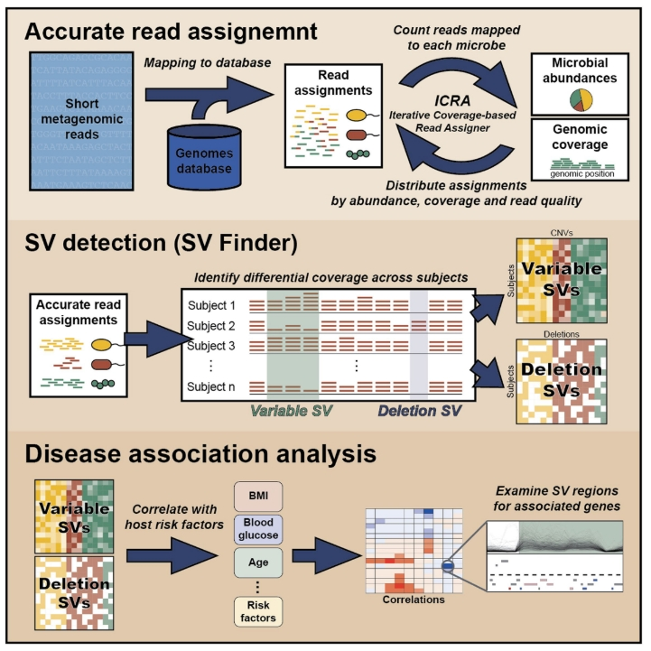

**1. 什么是微生物基因组的结构变异（Microbial Structural Variations）？**

通常基因组的结构变异是指大片段的DNA序列的变化（>50bp），包括插入、删除、倒位、复制
或者易位。 微生物基因组结构变异类似，但是由于大多数的微生物缺少完整基因组，同时基于二代
测序的宏基因组对微生物基因序列的获取是随机的，所以往往对基因组的覆盖比较低。因此，
目前鉴定微生物结构变异的方法还没统一的标准。

**2. 怎么检测微生物基因组的结构变异？**

目前做基因组结构变异的工具主要是[SGVfinder](https://github.com/segalab/SGVFinder),后续有更新的[SGVfinder2](https://github.com/korem-lab/SGVFinder2)工具。另外具体执行的时候，可以参考道明写的[文档](https://mp.weixin.qq.com/s/pdaERF8px_LE9pbhsMJQuA)，给了很好的troubleshooting。

该工具的思想是：基于精确的基因组覆盖度，在群体水平上检测两种变异：deletion和variable。

sgvfinder 流程图（Zeevi et al., 2019）

该工具主要分为3步:

step1：创建数据库，最后生成的文件包括：

- bowtie2比对文件
- .dlen文件：纳入基因组的长度文件
- .lengths文件：纳入基因组的所有contig或者scaffold的长度

step2: ICRA，目的是去重新分配同一条read分配到多个参考基因组的情况，应该也是最耗时间的部分。时间的复杂度主要和总的read数、参考基因组的数量有关。

这里解决的策略是使用一种迭代计算覆盖度直到收敛的方法（ICRA）。收敛的参数是基于相对丰度，覆盖度，比对的质量值设计的覆盖度贡献度δ。收敛的标准是δ小于预设的10^-6或者迭代特定的次数。初始化是基于bowtie2比对的文件，计算的每条有多重比对的read在基因组上初始贡献度，根据贡献度决定哪些read在原先比对上的地方是否丢掉，然后重新计算贡献度δ，直到δ不再变化，或者迭代达到特定
的数目。

这里覆盖度的计算会涉及到2个参数，每个bin的长度，默认1kbp，计算覆盖度用到的bin的比例，默认是60%。这里计算覆盖度用了一种更加稳定的方法。首先，将所有bin的覆盖度的值排序，然后以滑窗60%的子集，计算最高和最低覆盖度的差值。然后以差值最小的那个子集中所有覆盖度的中位数作为当前基因组的覆盖度。

step3: SV的计算，有两种模式。一种是基于参考基因组的，另外一种是基于群体水平的。

首先一些出现率比较低的genome将会去除。

- 中位数bin的比对上的read少于10条会在这个样本中认为没有出现，如果在群体里的出现率低于75个样本（可以设置）的基因组会被丢弃。

- 计算特定基因组在所有样本的中位数bin,如果有超过30%的bin的覆盖read低于1个，则删除（需要根据代码再确定下）

deletion SV的鉴定

- 鉴定deletion:首先针对每一个样本中的每一个基因组都有对应的覆盖度箱型图，确定一个谷值（需要代码确定），高于估值的保留，低于谷值的删除。如果在所有的25-75%的样本都被删除则认为这个bin是一个 deletion SV.

- 合并相邻deletion SV：如果相邻的两个deletion的相似性高于0.75，且合并后的deletion 需要仍然满足上述deletion的标准。

variable SV的鉴定

-  首先删除在95%的样本中都被认为要删除掉的bin
-  所有样本保留的bin的覆盖度归一化（这里产生的负值怎么处理？），然后拟合beta-prime分布（用于建模正偏态且长尾的数据），在分布top5的bin被认为是variable SV。

**3. 鉴定到微生物的结构变异后可以做什么？** 

3.0. 探索SV在不同物种的分布

3.1. 鉴定SV在同一个体稳定性

3.2. 鉴定与具体代谢物相关的SV

3.3  探索与具体表型的关系

**4. 和蛋白质结构预测怎么联系？ **

